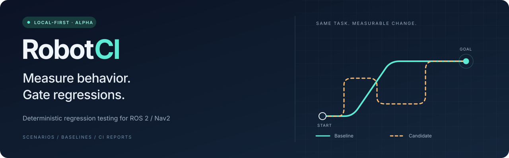
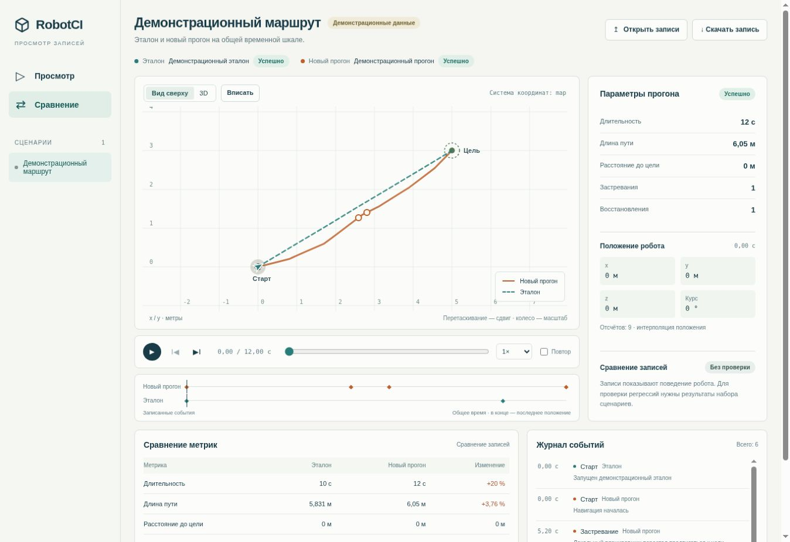

<p align="center">
  <a href="https://github.com/Evolut10n11/robotci/actions/workflows/ci.yml"></a>
  <a href="pyproject.toml"></a>
  <a href="docs/quickstart.md"></a>
  <a href="LICENSE"></a>
</p>

<p align="center">
  <a href="docs/quickstart.md">Quickstart</a> ·
  <a href="docs/README.md">Documentation</a> ·
  <a href="examples/nav2-loopback/README.md">Example</a> ·
  <a href="docs/roadmap.md">Roadmap</a> ·
  <a href="CONTRIBUTING.md">Contributing</a>
</p>

# RobotCI

Deterministic behavior regression testing for ROS 2 / Nav2.

Run repeatable navigation scenarios in simulation, compare a candidate with a
known-good baseline, and block changes that make robot behavior worse. RobotCI
records the measurements and produces reports your CI pipeline can act on.

**Public alpha · `0.1.0a1`** — available from this repository. The core workflow
is implemented; external validation is in progress. Start with simulation.

## What you can do today

| Capability | What you get |
| --- | --- |
| Define a suite | Validated YAML scenarios with explicit start, goal, map, timeout, and evidence policy |
| Run navigation tests | ROS2 Jazzy / Nav2 Loopback on Ubuntu 24.04 or through a Linux Docker runtime |
| Measure behavior | Duration, path length, distance to goal, stuck events, recoveries, and feedback quality |
| Gate a change | Named local baselines, compatibility checks, deterministic thresholds, and blocking exit codes |
| Review results in CI | JSON, Markdown, JUnit, and a reusable GitHub Action |
| Inspect a run | Synchronized replay comparison, diagnostics, support bundles, and six read-only MCP tools |

Navigation success alone is not enough. A robot can reach its goal and still take
a longer path or require more recoveries. RobotCI measures those changes against
the baseline. Missing telemetry or an incompatible environment produces an
infrastructure/input error rather than a misleading behavioral verdict.

## Start here

Python **3.12** is required. The alpha is source-distributed; keep the checkout
for runtime scripts and Docker resources.

<details open>
<summary><strong>Windows · PowerShell</strong></summary>

```powershell
git clone https://github.com/Evolut10n11/robotci.git
cd robotci
py -3.12 -m venv .venv
.\.venv\Scripts\Activate.ps1
python -m pip install -e .

robotci version
robotci validate
robotci plan
```

</details>

<details>
<summary><strong>Linux · Bash</strong></summary>

```bash
git clone https://github.com/Evolut10n11/robotci.git
cd robotci
python3.12 -m venv .venv
source .venv/bin/activate
python -m pip install -e .

robotci version
robotci validate
robotci plan
```

</details>

These checks run without ROS or Docker. To explore the local replay viewer:

```powershell
robotci view --demo
```

The viewer UI is in Russian. See the [Russian guide](docs/replay-viewer.ru.md).
If port 8765 is busy, pass `--port 8766` or `--port 0` to choose a free port.



*Local replay comparison. The built-in demo is synthetic and has no gate verdict.*

The demo is synthetic. Open a recorded replay to inspect an actual run.

### Run your first suite

With a working Linux-container Docker backend, run from the checkout:

```powershell
robotci doctor
robotci run --runtime docker
```

For native ROS2 Jazzy/Nav2 on Ubuntu 24.04, follow the
[runtime setup](docs/quickstart.md#native-runtime-setup) and use
`robotci run --runtime native`.

| Environment | Core tools | Simulation execution |
| --- | --- | --- |
| Windows / PowerShell | Supported | Requires a working Linux Docker backend or remote Ubuntu runner |
| Ubuntu 24.04 | Supported | Native ROS2 Jazzy/Nav2 or Docker |
| GitHub Actions | Windows and Ubuntu core checks | Ubuntu native and Docker runtime workflows |

### Save a baseline, then compare a change

After reviewing a successful suite:

```powershell
robotci-baseline save main-nav --suite .robotci/suite-result.json
robotci-baseline show main-nav
```

Make a real controller/planner/configuration change, then run the same suite in
the same execution environment:

```powershell
robotci run --runtime docker
robotci-baseline gate main-nav --candidate .robotci/suite-result.json
robotci view --suite .robotci/suite-result.json --baseline-name main-nav --port 0
```

The default regression policy allows up to **10%** more duration and path length,
**0.1 m** more final goal distance, and **no additional** stuck events or recoveries.
Thresholds are configurable. Changed tasks or incompatible runtime fingerprints
must be resolved before comparison.

| Exit code | Meaning |
| ---: | --- |
| `0` | PASS |
| `1` | Robot behavior FAIL |
| `2` | Navigation TIMEOUT |
| `3` | INFRA_ERROR or invalid/incompatible comparison input |
| `4` | REGRESSION detected by a comparison command |

Read the [full quickstart](docs/quickstart.md) for an external project and the
[baseline guide](docs/baselines.md) for reports and policy options.

## Bring it into your workflow

- **GitHub Actions:** the [suite regression action](docs/github-action.md)
  writes JSON, Markdown, and JUnit reports before returning a blocking verdict.
- **Replay:** `robotci view --replay .robotci/results/simple_route.replay.json`
  opens a recorded trajectory. Compare full suites with `--suite` and
  `--baseline-suite`, or open replay files directly in the browser. See the
  [viewer guide](docs/replay-viewer.md).
- **MCP:** install `python -m pip install -e ".[mcp]"`, then run `robotci-mcp`.
  The [MCP guide](docs/mcp.md) lists the six read-only inspection tools.
- **Your simulator:** use the [native adapter contract](docs/native-runtime-adapter.md)
  to integrate an existing Nav2 environment. Verify compatibility for that environment.

## Project status

| Area | Status |
| --- | --- |
| M0–M7: execution, metrics, regression, reproducibility, CI, public alpha | Implemented |
| M8: real-world validation | In progress; external evidence pending |
| M9: visual replay | Local workbench implemented: playback, 2D/3D, synchronized comparison, and suite gate evidence |
| M10: additional robot adapters | Planned; Unitree Go2 + MuJoCo is a candidate |
| M11: agent integration | Read-only MCP shipped; execution tools and reference agent remain planned |
| M12: team capabilities | Requires evidence from external pilots |

See the [roadmap](docs/roadmap.md) for scope and the
[validation register](docs/validation/README.md) for M8 evidence.

The current alpha targets Nav2 simulation. It is not a hardware safety
certification. Parallel suites sharing runtime/output resources are not supported;
broad simulator compatibility remains future work. See [runtime limitations](docs/runtime-integrity.md).

## Documentation and development

The [documentation index](docs/README.md) covers configuration, result contracts,
runtime integrity, reproducibility, integrations, and product direction.

To contribute from the activated environment:

```powershell
python -m pip install -e ".[dev]"
robotci validate
ruff check .
pytest -q
```

The Python core runs independently of ROS. See [CONTRIBUTING.md](CONTRIBUTING.md)
for repository structure, checks, and the branch lifecycle.

Found a problem? [Open a bug report](https://github.com/Evolut10n11/robotci/issues/new?template=bug_report.yml).
Tried a real project? [Share pilot feedback](https://github.com/Evolut10n11/robotci/issues/new?template=public_alpha_feedback.yml).

Licensed under [Apache 2.0](LICENSE).
