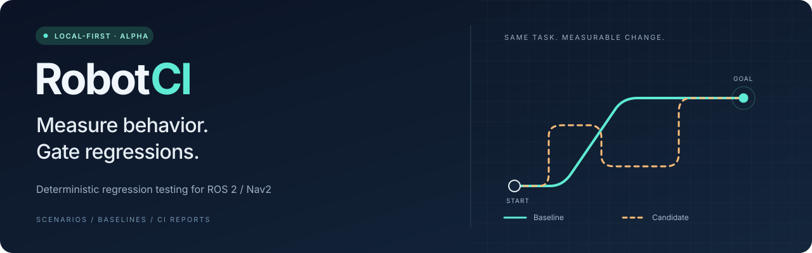

<p align="center">
  <a href="https://github.com/Evolut10n11/robotci/actions/workflows/ci.yml"></a>
  <a href="pyproject.toml"></a>
  <a href="docs/quickstart.md"></a>
  <a href="LICENSE"></a>
</p>

<p align="center">
  <a href="docs/quickstart.md">Quickstart</a> ·
  <a href="docs/README.md">Documentation</a> ·
  <a href="examples/nav2-loopback/README.md">Example</a> ·
  <a href="docs/roadmap.md">Roadmap</a> ·
  <a href="CONTRIBUTING.md">Contributing</a>
</p>

# RobotCI

[Описание на русском](#о-проекте) · [English overview and quickstart](#english-overview)

## О проекте

RobotCI проверяет, не стал ли робот хуже выполнять свои задачи после изменения
кода, алгоритмов или настроек. Это открытый инструмент регрессионного тестирования
поведения роботов: он запускает сценарии в симуляции, измеряет результат и
сравнивает его с ранее сохранённой рабочей версией.

Проект нужен разработчикам робототехнических систем, которым недостаточно
проверить, что программа собирается и проходит обычные тесты. Робот может
по-прежнему доезжать до цели, но делать это медленнее, выбирать более длинный путь
или чаще застревать. RobotCI помогает обнаруживать такие изменения на этапе
разработки, до испытаний на физическом роботе.

Первая целевая аудитория проекта: команды, использующие ROS 2 и Nav2 для навигации
и желающие включить проверку поведения в процесс проверки изменений кода и
автоматические проверки CI. RobotCI не заменяет навигационный стек или симулятор,
а связывает сценарии, измерения, сравнение версий и разбор результатов.

## Что уже умеет RobotCI

| Возможность | Для чего нужна |
| --- | --- |
| Сценарии в YAML | Задать карту, начальную позицию, цель, ограничение времени и требования к данным, подтверждающим результат |
| Запуск навигационных тестов | Выполнить один сценарий или набор сценариев в ROS 2 Jazzy / Nav2 Loopback через нативное Linux-окружение или Docker |
| Измерение поведения | Собрать время выполнения, длину пути, расстояние до цели, случаи застревания, восстановительные действия и показатели качества телеметрии |
| Сравнение с эталоном | Сохранить проверенный запуск под именем, сравнить с ним новую версию и выявить ухудшения по настраиваемым порогам |
| Интеграция с CI | Сформировать JSON, Markdown и JUnit-отчёты; через GitHub Action завершить проверку с ошибкой при обнаружении регрессии |
| Визуальный разбор | Открыть запись траектории в локальном интерфейсе на русском, посмотреть её в 2D/3D и синхронно сравнить два запуска |
| Интеграция с AI-агентами | Через MCP читать результаты и, при явном разрешении, запускать, отслеживать, отменять симуляции и сравнивать их с эталоном |

Эталонный запуск называется `baseline`, проверяемая новая версия называется
`candidate`. Сравнение выполняется только для совместимых задач и окружений.
Ошибки инфраструктуры, несовместимые входные данные и недостаточная телеметрия
отделяются от ухудшения поведения робота.

Решение о регрессии принимается по формальным правилам, а не языковой моделью.
При одинаковых валидированных результатах и настройках проверки вердикт одинаков;
сами измерения в симуляции могут различаться между запусками.

## Как это используется

```text
Проверенная версия → сценарии в симуляции → сохранённый эталон
Изменение кода или настроек → повторный запуск тех же сценариев
→ сравнение метрик → отчёт для CI → разбор отличий в replay
```

Например, разработчик меняет настройки контроллера движения. Робот всё ещё
достигает цели, но тратит больше времени и чаще выполняет восстановительные
действия. Если отличия превышают допустимые пороги, RobotCI отмечает регрессию,
возвращает блокирующий код завершения и показывает изменившиеся метрики.
Записанные траектории помогают разобраться, на каком участке поведение отличается.

Для знакомства без запуска симулятора доступно демо:

```powershell
robotci view --demo
```

Установка описана [ниже](#start-here). Демо использует синтетические данные и не
выдаёт вердикт о качестве реального робота.

## Текущее состояние и ограничения

Текущая версия: публичная альфа `0.1.0a1`. Основной цикл от запуска сценариев до
сравнения, CI-отчёта и визуального разбора реализован. Внешняя проверка на проектах
других команд пока продолжается; наличие внутренних тестов не означает, что
совместимость подтверждена для любого робота или симулятора.

Основное поддерживаемое направление сейчас: навигация ROS 2 / Nav2.
Интеграция Nav2 с Gazebo Harmonic доступна как экспериментальная и имеет отдельный
[журнал проверок](docs/validation/runtime-acceptance.md).

Проверка конфигурации, планирование и просмотр записей доступны на Windows без
ROS и Docker. Для выполнения симуляций нужен Ubuntu с ROS 2 / Nav2, работающий
Docker с Linux-контейнерами или отдельный Ubuntu runner.

Модели ровера, четвероногого робота и гуманоида в просмотрщике меняют только
визуальное представление. Они не означают поддержку управления этими роботами
или воспроизведение движений их суставов. RobotCI также не является системой
сертификации безопасности и не заменяет испытания на физическом оборудовании.

## Что планируется дальше

Ближайший приоритет: подтвердить полезность основного сценария на внешних проектах,
а затем расширять продукт на основе реальных задач пользователей.

| Направление | Планируемое развитие |
| --- | --- |
| Внешние пилоты и надёжность | Проверить полный цикл на проектах других команд, собрать результаты и ограничения; расширить измеренные Nav2/Gazebo-проверки на новые маршруты и окружения |
| Новые роботы и симуляторы | Добавлять адаптеры за пределами Nav2. Unitree Go2 с MuJoCo рассматривается как кандидат для первого такого эксперимента; Isaac Sim/Lab и другие ROS 2-роботы остаются возможными дальнейшими направлениями |
| Визуальная диагностика и AI | Развивать контекст карты и событий в replay по задачам пользователей; поверх существующего MCP исследовать диагностику причин регрессий, связь с изменениями кода и интеграции LangGraph/LangChain. Итоговый вердикт останется детерминированным |
| Командная работа | После подтверждения потребности в пилотах проработать общие эталоны, постоянную историю запусков, динамику метрик между изменениями и совместные правила проверки |

В перспективе новые адаптеры могут расширить проверки за пределы навигации:
например, на падения, проскальзывание ног, расход энергии и ограничения суставов.
Сейчас эти метрики не входят в поддерживаемую схему результатов.

Это направления развития, а не список уже готовых возможностей или обещание
сроков. Подробные статусы находятся в [дорожной карте](docs/roadmap.md),
а назначение и принципы развития описаны в [продуктовом плане](docs/product.md).

## English overview

Behavior regression testing for ROS 2 / Nav2 with deterministic verdicts.

Run repeatable navigation scenarios in simulation, compare a candidate with a
known-good baseline, and block changes that make robot behavior worse. RobotCI
records the measurements and produces reports your CI pipeline can act on.

**Public alpha · `0.1.0a1`** — available from this repository. The core workflow
is implemented; external validation is in progress. Start with simulation.

## What you can do today

| Capability | What you get |
| --- | --- |
| Define a suite | Validated YAML scenarios with explicit start, goal, map, timeout, and evidence policy |
| Run navigation tests | ROS2 Jazzy / Nav2 Loopback on Ubuntu 24.04 or through a Linux Docker runtime |
| Measure behavior | Duration, path length, distance to goal, stuck events, recoveries, and feedback quality |
| Gate a change | Named local baselines, compatibility checks, deterministic thresholds, and blocking exit codes |
| Review results in CI | JSON, Markdown, JUnit, and a reusable GitHub Action |
| Inspect a run | 2D/3D replay with robot visual profiles, synchronized comparison, observed stuck/recovery events, and six read-only MCP tools |
| Orchestrate a simulation | Explicitly enabled MCP start/status/cancel/compare tools with isolated evidence and owned runtime cleanup |

Navigation success alone is not enough. A robot can reach its goal and still take
a longer path or require more recoveries. RobotCI measures those changes against
the baseline. Missing telemetry or an incompatible environment produces an
infrastructure/input error rather than a misleading behavioral verdict.

Verdicts are deterministic for the same validated artifacts and policy.
Simulation measurements can vary; unchanged runs must establish a usable
baseline before a controller intervention is accepted.

## Start here

Python **3.12** is required. The alpha is source-distributed; keep the checkout
for runtime scripts and Docker resources.

<details open>
<summary><strong>Windows · PowerShell</strong></summary>

```powershell
git clone https://github.com/Evolut10n11/robotci.git
cd robotci
py -3.12 -m venv .venv
.\.venv\Scripts\Activate.ps1
python -m pip install -e .

robotci version
robotci validate
robotci plan
```

</details>

<details>
<summary><strong>Linux · Bash</strong></summary>

```bash
git clone https://github.com/Evolut10n11/robotci.git
cd robotci
python3.12 -m venv .venv
source .venv/bin/activate
python -m pip install -e .

robotci version
robotci validate
robotci plan
```

</details>

These checks run without ROS or Docker. To explore the local replay viewer:

```powershell
robotci view --demo
```

The viewer UI is in Russian. See the [Russian guide](docs/replay-viewer.ru.md).
If port 8765 is busy, pass `--port 8766` or `--port 0` to choose a free port.

The demo is synthetic and has no gate verdict. Open a recorded replay to inspect
an actual run.

The workbench includes rover, quadruped, and humanoid visual models. Set
`robot.visual_profile` in `robotci.yaml` to choose the model for new recordings,
or preview another model in the viewer. This changes the display; execution
continues to use the configured Nav2 runtime. See the
[visual profile contract](docs/contracts.md#robot-visual-profile).

### Run your first suite

With a working Linux-container Docker backend, run from the checkout:

```powershell
robotci doctor
robotci run --runtime docker
```

For native ROS2 Jazzy/Nav2 on Ubuntu 24.04, follow the
[runtime setup](docs/quickstart.md#native-runtime-setup) and use
`robotci run --runtime native`.

| Environment | Core tools | Simulation execution |
| --- | --- | --- |
| Windows / PowerShell | Supported | Requires a working Linux Docker backend or remote Ubuntu runner |
| Ubuntu 24.04 | Supported | Native ROS2 Jazzy/Nav2 or Docker |
| GitHub Actions | Windows and Ubuntu core checks | Ubuntu native and Docker runtime workflows |

### Save a baseline, then compare a change

After reviewing a successful suite:

```powershell
robotci-baseline save main-nav --suite .robotci/suite-result.json
robotci-baseline show main-nav
```

Make a real controller/planner/configuration change, then run the same suite in
the same execution environment:

```powershell
robotci run --runtime docker
robotci-baseline gate main-nav --candidate .robotci/suite-result.json
robotci view --suite .robotci/suite-result.json --baseline-name main-nav --port 0
```

The default regression policy allows up to **10%** more duration and path length,
**0.1 m** more final goal distance, and **no additional** stuck events or recoveries.
Thresholds are configurable. Changed tasks or incompatible runtime fingerprints
must be resolved before comparison.

| Exit code | Meaning |
| ---: | --- |
| `0` | PASS |
| `1` | Robot behavior FAIL |
| `2` | Navigation TIMEOUT |
| `3` | INFRA_ERROR or invalid/incompatible comparison input |
| `4` | REGRESSION detected by a comparison command |

Read the [full quickstart](docs/quickstart.md) for an external project and the
[baseline guide](docs/baselines.md) for reports and policy options.

## Bring it into your workflow

- **GitHub Actions:** the [suite regression action](docs/github-action.md)
  writes JSON, Markdown, and JUnit reports before returning a blocking verdict.
- **Replay:** `robotci view --replay .robotci/results/simple_route.replay.json`
  opens a recorded trajectory. Compare full suites with `--suite` and
  `--baseline-suite`, or open replay files directly in the browser. See the
  [viewer guide](docs/replay-viewer.md).
- **MCP:** install `python -m pip install -e ".[mcp]"`, then run `robotci-mcp`.
  The [MCP guide](docs/mcp.md) lists the six default inspection tools and four
  opt-in managed simulation tools. Execution requires an explicit project,
  configuration and `--allow-execution`; the model does not decide gate verdicts.
  The [reference workflow](examples/mcp-agent/README.md) demonstrates diagnosis,
  owned execution, polling, cancellation and deterministic comparison.
- **Your simulator:** use the [native adapter contract](docs/native-runtime-adapter.md)
  to integrate an existing Nav2 environment. Verify compatibility for that environment.
- **Experimental Gazebo:** the [Jazzy/Harmonic TurtleBot example](examples/nav2-gazebo/README.md)
  launches a fresh physical simulation and verifies readiness, controller
  settings, local-costmap frame, telemetry and owned cleanup. Its
  [acceptance record](docs/validation/runtime-acceptance.md) tracks measured
  baseline stability and controller interventions. Two independent map-frame
  experiments each passed all 20 within-cohort comparisons and both controls,
  then detected sole duration regressions of +120.816% and +102.056%. Runner
  dependency changes produced separate fingerprints; direct cross-cohort gates
  remain incompatible.

## Project status

| Area | Status |
| --- | --- |
| M0–M7: execution, metrics, regression, reproducibility, CI, public alpha | Implemented |
| M8: real-world validation | In progress; external evidence pending |
| M9: visual replay | Local workbench with robot visual profiles, playback, 2D/3D, synchronized comparison, and suite gate evidence |
| M10: additional robot adapters | Planned; Unitree Go2 + MuJoCo is a candidate |
| M11: agent integration | Six inspection tools, four opt-in managed simulation tools and a reference MCP workflow |
| Nav2 / Gazebo acceptance | Experimental setup succeeded in two separately fingerprinted internal experiments; each passed 20/20 baseline gates and both controls, and detected the real speed regression |
| M12: team capabilities | Requires evidence from external pilots |

See the [roadmap](docs/roadmap.md) for scope and the
[validation register](docs/validation/README.md) for M8 evidence.

The current alpha targets Nav2 simulation. It is not a hardware safety
certification. Parallel suites sharing runtime/output resources are not supported;
broad simulator compatibility remains future work. See [runtime limitations](docs/runtime-integrity.md).

## Documentation and development

The [documentation index](docs/README.md) covers configuration, result contracts,
runtime integrity, reproducibility, integrations, and product direction.

To contribute from the activated environment:

```powershell
python -m pip install -e ".[dev]"
robotci validate
ruff check .
pytest -q
```

The Python core runs independently of ROS. See [CONTRIBUTING.md](CONTRIBUTING.md)
for repository structure, checks, and the branch lifecycle.

Found a problem? [Open a bug report](https://github.com/Evolut10n11/robotci/issues/new?template=bug_report.yml).
Tried a real project? [Share pilot feedback](https://github.com/Evolut10n11/robotci/issues/new?template=public_alpha_feedback.yml).

Licensed under [Apache 2.0](LICENSE).
